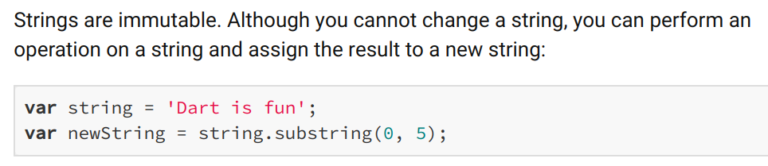

Getter Gotchas
--------------


### Forbidding bad hobbies

```dart
class Hobby {
  String name;
  int calorieBurn;

  Hobby(this.name, this.calorieBurn);

  @override
  String toString() {
    return '${name}: 😰 $calorieBurn cal/hr';
  }
}

class Person {
  bool isChristian = false;
  String name;
  List&lt;Hobby&gt; _hobbies = []; // ensure not null

  learnHobby(Hobby newHobby) {
    // we can change list to another data structure later
    // or even reject hobbies already learned
    // or maybe reject hobbies bad for the health
    final forbidden = ['smoking','drinking','debauchery'];
        
    if (isChristian && forbidden.contains(newHobby.name)) {
      _hobbies.add(Hobby('Bible reading', 81));
    } else {
      _hobbies.add(newHobby);
    }
  }

  List&lt;Hobby&gt; get hobbies => _hobbies;

  Person({ this.name, this.isChristian });
}

// main.dart
void main() {
  final person = Person(name: 'Paul', isChristian: true);
  person.learnHobby(Hobby('smoking',  250));
  print(person.hobbies);
}
```

Output:

<pre>
[Bible reading: 😰 81 cal/hr]
</pre>


### Ze verld don't need more smokers


### `learnHobby` protection is a scam!


### The getter returns a reference to the mutable `_hobbies`

```dart
void main() {
  final person = Person(name: 'Paul', isChristian: true);
  person.learnHobby(Hobby('smoking',  250));
  print(person.hobbies);
  
  person.hobbies.removeAt(0);
  person.hobbies.add(Hobby('smoking', 250));
  print('--- LOOK MA, I CAN MODIFY _hobbies freely ---');
  print(person.hobbies);
}
```

<pre>
[Bible reading: 😰 cal/hr]
--- LOOK MA, I CAN MODIFY _hobbies freely ---
[smoking: 😰 250 cal/hr]
</pre>

But why does this happen?


### Object variables are references

* They're like remote controls
  - You can have 3 remotes controlling 1 TV
  - You only create a new TV when you instantiate
  - remember: `Person()` is the same as `new Person()`

```dart
var ninja = Person(name: 'Itachi');
var another = ninja;
another.name = 'Mike';
print('Result of ninja.name: ' + ninja.name);
```

<pre>
Result of ninja.name: Mike
</pre>

Both `ninja` and `another` are remotes for our `Person`, the only instance we created.


### Other classes can modify objects returned by getters

* A list is an object, with methods like `add` and `remove` for modifying list contents
* It is also true for one-to-one relationships
* The getter returns a _"remote control"_ to control the returned list

```dart
// person.hobbies is a remote control like the `another` 
// variable (and also `ninja`) in the previous slide
person.hobbies.removeAt(0);
person.hobbies.add(Hobby('smoking', 250));
print(person.hobbies);
```


### `_hobbies` acts as if it were public


### But we have been returning `String` and `DateTime` objects until now

+ `String`s and `DateTime`s are **IMMUTABLE**
  - from the Dart API docs

    

  - none of its methods can change the String


### Dart API docs doesn't mention `DateTime` is immutable

+ there are lots of ways to verify this
  - Google/Github search that produces [this](https://github.com/google/built_value.dart/issues/111#issuecomment-275609045) and [this](https://medium.com/@florian_32814/date-time-526a4f86badb)
  - look at every member in [`DateTime` docs](https://api.dart.dev/stable/2.8.4/dart-core/DateTime-class.html)
    + no setters, just a bunch of read-only getters and a final `isUtc`
    + methods like `add` and `subtract` return new `DateTime`s
    
    ```dart
    var now = DateTime.now();
    var yesterday = now.subtract(Duration(days: 1));
    print(now); // July 24 23:10, unmodified
    print(yesterday); // July 23, 23:10
    ```


### 10 slides, many memes, no solution

* just return a copy of `_hobbies` (an FP-ish idea)
  - more of this idea will be discussed in SE-2123

```dart [4 | 7-15]
class Person {
  /* everything else is the same */

  List&lt;Hobby&gt; get hobbies => List.from(_hobbies);
}

// main.dart
final person = Person(name: 'Paul', isChristian: true);
person.learnHobby(Hobby('smoking',  250));
print(person.hobbies); // [Bible reading: 😰 81 cal/hr]

person.hobbies.removeAt(0);
person.hobbies.add(Hobby('smoking', 250));
print("--- HEY MA, was wonderin' why I can't smoke ---");
print(person.hobbies); // [Bible reading: 😰 81 cal/hr]
```


### Wow, magic!  What's going on?

* `List.from` is a **copy contructor**
  - It's also a [named constructor]((https://dart.dev/guides/language/language-tour#constructors))
    just like `DateTime.now()`
  - all constructors return new objects, so our `List` is new

```dart
// main.dart
final remoteControlToAnotherList = person.hobbies;
remoteControlToAnotherList.removeAt(0);
remoteControlToAnotherList.add(Hobby('smoking', 250));
print("~ HEY MA, my new hobby gets added to a ghost list ~");
print('ghost list contents: $remoteControlToAnotherList');
print("~ Yup, bad hobby can't get in (I Cor 6:12,19-20) ~");
print('person.hobbies contents: ${person.hobbies}');
```

<pre>
~ HEY MA, my new hobby gets added to a ghost list ~
ghost list contents: [smoking: 😰 250 cal/hr]
~ Yup, bad hobby can't get in (I Cor 6:12,19-20) ~
person.hobbies contents: [Bible reading: 😰 81 cal/hr]
</pre>


### What about for one-to-one?
* No `.from(...)` in our custom domain classes
  - and Dart has no built-in mechanism to clone

```dart [1-9 | 11-22 | 24-30]
class Ninja {
  String name;
  int chakraLevel;

  Ninja({ this.name, this.chakraLevel });

  Ninja.clone(Ninja ninja) : 
    this(name: ninja.name, chakraLevel: ninja.chakraLevel);
}

// main.dart
final naruto = Ninja(name: 'Naruto', chakraLevel: 99999);
final stillNaruto = naruto; // remote control to `naruto`
stillNaruto.chakraLevel = 50;
print("Naruto's chakra: ${naruto.chakraLevel}");
final aRealClone = Ninja.clone(naruto);
aRealClone.chakraLevel = 700;
aRealClone.name = 'Boruto';
print("Orig's name: ${naruto.name}");
print("Orig's chakra: ${naruto.chakraLevel}");
print("Clone's name: ${aRealClone.name}");
print("Clone's chakra: ${aRealClone.chakraLevel}");

/*
Naruto's chakra: 50
Orig's name: Naruto
Orig's chakra: 50
Clone's name: Boruto
Clone's chakra: 700
*/
```


### So we have to clone getter returns every time?

- is it OK for some random class to do something like:
```dart
veterinarian.license.expiryDate = Date(2030, 7, 25);
```

  + if it's OK, then cloning is just a waste of effort, CPU cycles, and battery 😅
  + if not, give your 1:1 and 1:n getters some careful thought
- **mutable state can lead to debugging nightmares**, especially if you can't trace which random 
  spell class changed the `damage` of your Orc's weapon
