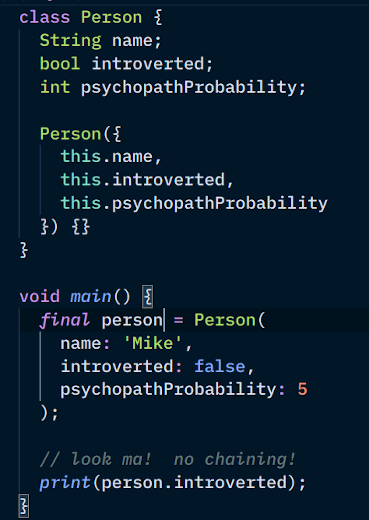
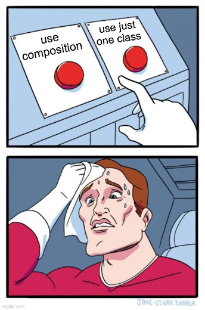

One-to-one
----------


### No new syntax or keyword to learn

You already know how to do this, when you create a class, you create a new data type

```dart [1-10 | 12-17 | 13 | 19-27 | 28-34]
class Personality {
  bool introverted;
  int psychopathProbability;
  // some other traits, the more the uniquer!

  Personality({
    this.introverted, 
    this.psychopathProbability
  }) {}
}

class Person {
  Personality personality;
  String name;

  Person({this.name, this.personality}) {}
}

// main.dart
final personality = Personality(
  introverted: true, 
  psychopathProbability: 92
);
final psychopathicIntrovert = Person(
  name: "Mike", 
  personality: personality
);
final normalExtrovert = Person(
  name: "Richard",
  personality: Personality(
    introverted: false,
    psychopathProbability: 3
  )
)
```


### Just beware of `null`s when chaining (1/2)

* Remember that named params are optional, and not compiler-enfored (as of Dart 2.8.3)

```dart
final brokenEmotionlessDude = Person(name: 'Sai');
print(brokenEmotionlessDude.personality.introvered); // ❌❌❌
```

* You can use optional chaining
  - not available in every language
* use conditionals to check for `null`s
  - works in all languages with `null`/`nil`/`None` values


### Just beware of `null`s when chaining (2/2)

* Everything is an object in Dart, and everything is nullable (as of Dart 2.8.3)
  - even integers and Strings
  - `person.name.toUpperCase()` may actually crash
* Optional-chaining operator `?.`

```dart
final brokenEmotionlessDude = Person(name: 'Sai');
print(brokenEmotionlessDude.personality?.introvered); // null

// Don't lazily use ?. everywhere
// Code full of ?. can indicate some code smell
// lack of analysis, unfounded paranoia, trust issues 😁
```


### Why not this approach?

<div style="display: flex;">
  <div style="flex: 1" class="fragment">
    
  </div>

  <div style="flex: 1" class="fragment">
    
  </div>
</div>


### Remember the Single Responsibility Principle (SRP)?

* What if personality details are not compulsory or urgent? <!-- .element style="font-size: 0.9em" -->
  - like a `Person` who has not yet taken a personality test?
  - like a `Person` who wants to keep his personality private?

```dart
final me = Person(name: 'Mike'); // no personality test yet
print('Introvert? ${me.introverted}'); // null
print('Psychopath %: ${me.psychopathProbability}%'); // null
```
  
* The two `print` statements would output `null`.
  - an object full of `null`s is a huge clue that your class is violating SRP


### Why do objects containing tons of `null`<span style="text-transform: none">s</span> a violation of SRP?

It's your turn to ponder and think.  Share it [here](https://canvas.instructure.com/courses/2109863/discussion_topics/9412164).

The evil author of this slides is not in the mood to ponder and think.

 <!-- .element style="width: 44 0px; height: 250px;" -->
